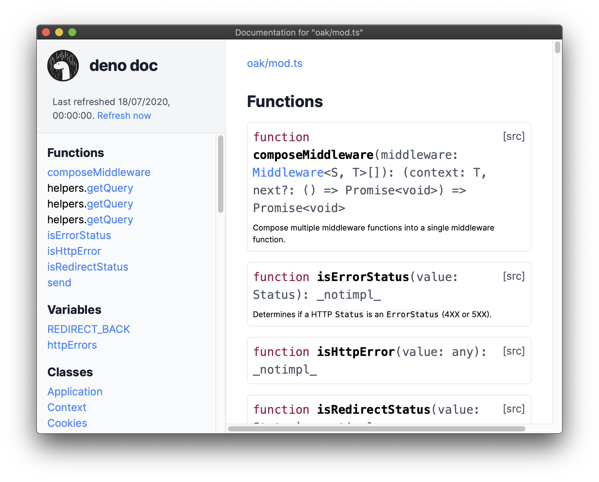

<br />
<p align="center">
  

  <h3 align="center">ddoc</h3>

  <p align="center">
    Offline / Local deno documentation
 </p>
</p>

---
> ⚠️ This project is work in progress. Expect breaking changes.
---

## installation

```bash
deno install -A -f --unstable https://deno.land/x/ddoc/ddoc.ts
```

## dev installation

Clone the repository and its only submodule ([`denosaurs/doc_website`](https://github.com/denosaurs/doc_website)):

```bash
git clone --recurse-submodules https://github.com/denosaurs/ddoc
```

Statically build the `denosaurs/doc_website` using the build script:

```bash
deno run -A scripts/build.ts
```

Install the executable to your path:

```bash
deno install -A -f --unstable ddoc.ts
```

## other

### contributions

Pull request, issues and feedback are very welcome. Code style is formatted with `deno fmt` and commit messages are done following [Conventional Commits](https://www.conventionalcommits.org/en/v1.0.0/) spec.

### license

Copyright 2020-present, the denosaurs team. All rights reserved. MIT license.
